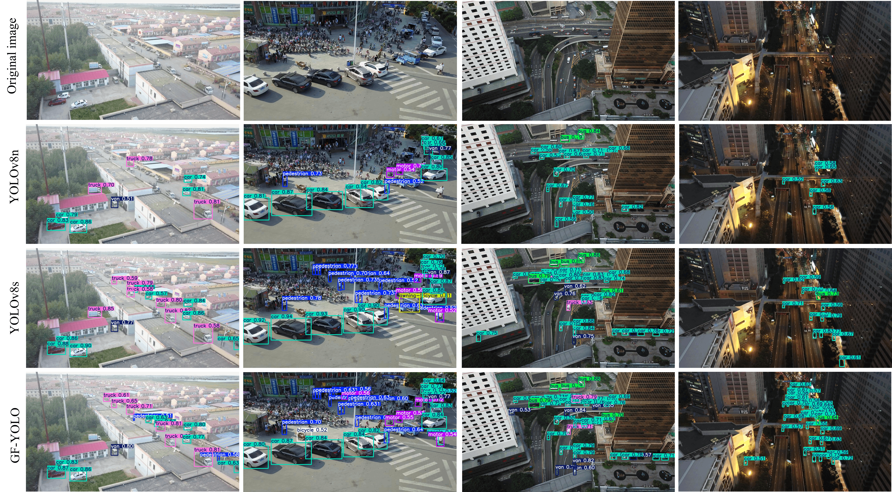
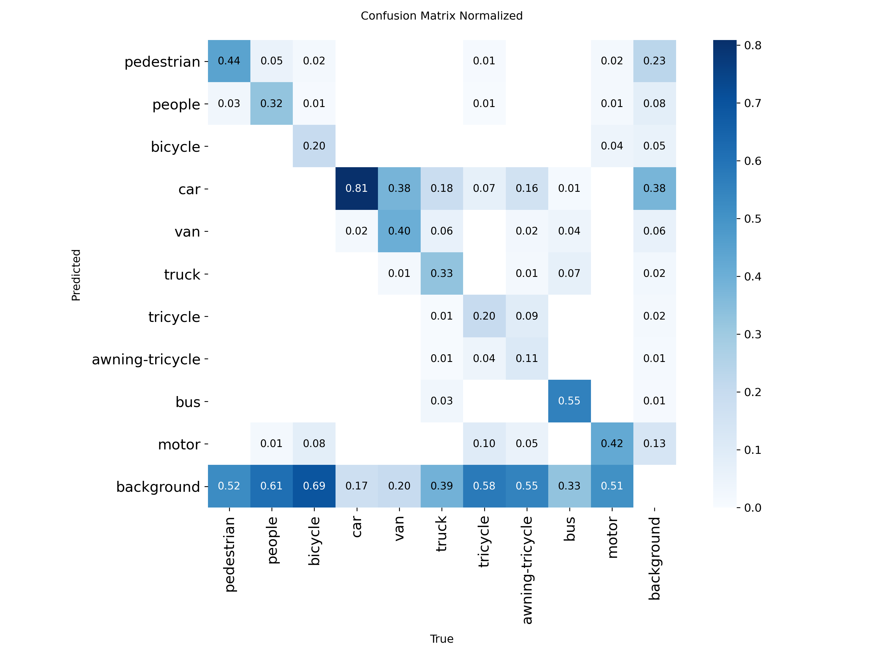

# ‎Title –Improved YOLOv8n model for efficient aerial object detection

## 📝 Overview

This repository contains the implementation of **GF-YOLO**, an improved YOLO model based on YOLOv8n specifically designed for small object detection in UAV aerial images. Our method addresses the challenges of high proportion of small targets, substantial scale variations, and complex backgrounds while maintaining computational efficiency suitable for edge devices.

## 🚀 Key Improvements

### 1. Scale-Adaptive Network Architecture

- **P2 Layer Addition**: Introduced a dedicated P2 detection layer for enhanced small-object detection capability
- **P5 Layer Removal**: Removed the P5 layer designed for large objects to reduce computational overhead
- **Shallow Channel Expansion (SCE)**: Proposed strategy to increase channel dimensions of shallow backbone layers, capturing more comprehensive features for small objects

### 2. Global Feature Fusion Architecture (GFF)

- **Multi-scale Feature Fusion (MFF)**: Efficient cross-scale semantic information propagation
- **Weighted Feature Fusion (WFF)**: Deep feature integration through adaptive weighting
- **Cascaded Strategy**: Combines MFF and WFF modules for optimal feature fusion in the neck network

### 3. Dynamic Detection Head (DyHead)

- **Multiple Attention Mechanisms**: Spatial, channel, and scale attention integration
- **Adaptive Response Adjustment**: Dynamic weight adjustment across different levels, spatial locations, and channels
- **Enhanced Feature Representation**: Improved localization accuracy for small objects

## 🏗️ Model Architecture

```

```


## 📊 Datasets Used

### Primary Dataset

- **Dataset**: VisDrone2019
- **Source**: http://aiskyeye.com/
- **Classes**: 10 object categories (person, bicycle, car, van, truck, tricycle, awning-tricycle, bus, motor, others)
- **Images**: 8,629 (train), 548 (val), 1,610 (test)
- **Challenges**: High density, small objects, complex backgrounds

### Validation Dataset

- **Dataset**: DOTA (Dataset for Object Detection in Aerial Images)
- **Source**: https://github.com/ultralytics/assets/releases/download/v0.0.0/DOTAv1.zip
- **Purpose**: Generalization ability validation
- **Classes**: 15 object categories
- **Characteristics**: Multi-scale, oriented objects

### Data  Augmentation

During training, several online data augmentation strategies were applied to the input images to improve model generalization and robustness:

| Augmentation Strategy      | Parameter                                               |
| -------------------------- | ------------------------------------------------------- |
| Mosaic augmentation        | probability = 1.0 (disabled during the last 190 epochs) |
| Mixup augmentation         | ratio = 0.0 (not applied)                               |
| HSV color augmentation     | hue = 0.015, saturation = 0.7, value = 0.4              |
| Random horizontal flipping | probability = 0.5                                       |
| Random scaling             | range = 0.5                                             |

These augmentations were applied on-the-fly during training (i.e., dynamically generated at each epoch rather than precomputed and stored), and are configured via the training pipeline (see `train.py` and the corresponding YAML configuration files in `cfg/`). No additional offline preprocessing (e.g., manual cropping, denoising, or normalization beyond the standard YOLO input pipeline) was applied to the VisDrone2019 and DOTA datasets.

### Data  Augmentation

No explicit data preprocessing was performed on the VisDrone2019 and DOTA datasets. Both datasets were  used with their original official splits and annotation formats as provided by the dataset creators.  Input images were resized on-the-fly by the YOLOv8 data loader to the model's default input resolution  during both training and inference. 

## Environment

The project was developed and tested under the following environment:

### System Environment

| Component | Version |
| --------- | ------- |
| Python    | 3.9     |
| CUDA      | 11.8    |

### Python Dependencies

torch==2.3.0
torchvision==0.18.0
Pillow==9.5.0
opencv-python==4.12.0.88
lap==0.5.12
matplotlib==3.10.6
mmcv==2.2.0
mmengine==0.10.7
numpy==2.2.6
pandas==2.3.2
psutil==7.1.0
pytest==9.0.2
requests==2.32.5
scipy==1.15.3
thop==0.1.1-2209072238
timm==1.0.20
tqdm==4.67.1
PyYAML==6.0.2

## 🛠️ Implementation Details

### Training Configuration

```yaml
# Training settings for VisDrone2019
epochs=200
batch=16
imgsz=640

lr0=0.01,
lrf=0.01
momentum=0.937,
weight_decay=0.0005,
warmup_momentum=0.8,
warmup_bias_lr=0.1,
warmup_epochs=3.0,
save_period=50,
plots=True,
verbose=True,
cache=True,
scale=0.5,
fliplr=0.5,
mosaic=1.0,
mixup=0.0,
hsv_h=0.015,
hsv_s=0.7,
hsv_v=0.4,
```

### 📁 Repository Structure

├── cfg/                     # Model configuration files for each ablation variant 

│   ├── A.yaml               # P2 layer added 

│   ├── B.yaml               # P2 + P5 removed 

│   ├── C.yaml               # + SCE 

│   ├── D.yaml               # + GFF 

│   ├── E.yaml               # + DyHead 

│   ├── F.yaml               # SCE + GFF 

│   └── GF-YOLO.yaml               # Full model (GF-YOLO) 

├── Experiments data/         Training/validation data and logs corresponding to each variant 

│   ├── A/ 

│   ├── B/ 

│   ├── ... 

│   └── GF-YOLO/ 

├── train.py                 # Main training script

### 🔬 Ablation Experiment Configuration Mapping

Each ablation configuration listed in the "Component Analysis on VisDrone2019" table corresponds to a YAML file in `cfg/` and a results folder in `Experiments data/` with the same name (A–G):

| Config  | cfg file         | Experiments data folder | Modules enabled                   |
| ------- | ---------------- | ----------------------- | --------------------------------- |
| A       | cfg/A.yaml       | Experiments data/A/     | P2                                |
| B       | cfg/B.yaml       | Experiments data/B/     | P2 + Delete P5                    |
| C       | cfg/C.yaml       | Experiments data/C/     | P2 + Delete P5 + SCE              |
| D       | cfg/D.yaml       | Experiments data/D/     | P2 + Delete P5 + GFF              |
| E       | cfg/E.yaml       | Experiments data/E/     | P2 + Delete P5 + DyHead           |
| F       | cfg/F.yaml       | Experiments data/F/     | P2 + Delete P5 + SCE + GFF        |
| GF-YOLO | cfg/GF-YOLO.yaml | Experiments data/G/     | Full model (P2+P5+SCE+GFF+DyHead) |


### 🏃‍♂️Training 

The `train.py` script supports flexible model training without modifying source code. All ablation model configuration files are stored in the `cfg/` directory. Users can load different network structures by switching model yaml files using `model = YOLO('cfg/GF-YOLO.yaml')`. The dataset is specified via the data argument in the training function. For VisDrone2019, configure `data="E://python_program//visdrone_yolo//VisDrone2019.yaml"`; for the DOTA dataset, use the official yaml file `ultralytics/cfg/datasets/DOTAv1.5.yaml`. Replace GF-YOLO.yaml with other configuration files under the cfg folder to reproduce each ablation experiment. Please update all absolute dataset paths to your local directory before execution. Example core code in train.py: 

```
model = YOLO('cfg/GF-YOLO.yaml') 

model.train(  data="E://python_program//visdrone_yolo//VisDrone2019.yaml"...... )
```


## ⚡ Performance Results

### Main Results on VisDrone2019

|         Model          | mAP50 | mAP50:95 | Params | GFLOPs |
| :--------------------: | :---: | :------: | :----: | :----: |
|     Faster  R-CNN      | 35.8  |   19.7   |   -    |   -    |
|      Sparse  DETR      | 42.5  |   27.3   |   -    | 121.0  |
| Vectorized  IOU-YOLOv5 | 44.6  |   26.6   |  19.3  |   -    |
|       UN-YOLOv5s       | 40.5  |   22.5   |   -    |  37.4  |
|      YOLOv7-tiny       | 35.0  |   18.5   |  6.04  |  13.3  |
|        YOLOv8s         | 40.4  |   24.0   |  11.1  |  28.7  |
|  Drone-YOLO  (large)   | 40.7  |    -     |  76.2  |   -    |
|        EBO-YOLO        | 41.1  |    -     |  8.0   |  20.4  |
|        EdgeYOLO        | 44.8  |    -     |  40.5  | 109.1  |
|       BDP-YOLOs        | 45.0  |   27.4   |  5.8   |  36.7  |
|       LRDS-YOLO        | 43.6  |   26.6   |  4.07  |  23.7  |
|        GF-YOLO         | 44.9  |   27.9   |  2.3   |  23.5  |


### Generalization Results on DOTA

|  Model   | *mAP*@0.5/% | *mAP*@0.5:0.95/% | Params/M |
| :------: | :---------: | :--------------: | :------: |
| YOLOv8n  |    40.9     |       24.6       |   3.0    |
| YOLOv11n |    39.7     |       24.6       |   2.6    |
| YOLOv8s  |    44.2     |       27.2       |   11.2   |
| YOLOv11s |    44.0     |       27.7       |   9.5    |
| GF-YOLO  |    46.6     |       28.6       |   2.3    |

### 🔬 Ablation Studies

### Component Analysis on VisDrone2019

|  Model  |  P2  | Remove P5 | SCE  | GHF  | DyHead | P    | R    | mAP50 | mAP50:95 | Params | GFLOPs |
| :-----: | :--: | :-------: | :--: | :--: | :----: | ---- | ---- | ----- | -------- | ------ | ------ |
| YOLOv8n |      |           |      |      |        | 44.5 | 32.8 | 33.0  | 19.3     | 3.0    | 8.9    |
|    A    |  √   |           |      |      |        | 48.7 | 35.6 | 37.1  | 22.3     | 2.9    | 12.4   |
|    B    |  √   |     √     |      |      |        | 47.2 | 35.7 | 36.6  | 21.9     | 1.0    | 10.6   |
|    C    |  √   |     √     |  √   |      |        | 50.3 | 37.1 | 38.7  | 23.4     | 1.0    | 12.8   |
|    D    |  √   |     √     |      |  √   |        | 48.8 | 36.2 | 37.9  | 22.8     | 1.1    | 12.5   |
|    E    |  √   |     √     |      |      |   √    | 52.4 | 39.9 | 41.7  | 25.3     | 2.0    | 17.4   |
|    F    |  √   |     √     |  √   |  √   |        | 51.6 | 40.4 | 42.0  | 25.4     | 1.2    | 16.2   |
|    G    |  √   |     √     |  √   |  √   |   √    | 54.5 | 42.0 | 44.9  | 27.9     | 2.3    | 23.5   |


## 📈 Visualization Results

### Detection Examples on VisDrone2019







## 🔬 Technical Contributions

### Novel Architecture Design

1. **Scale-Aware Detection**: P2/P5 layer modification optimized for small objects
2. **Feature Enhancement**: SCE strategy improves shallow feature representation
3. **Adaptive Fusion**: GFF architecture with MFF and WFF modules
4. **Dynamic Attention**: Multi-level attention mechanism in detection head

### Computational Efficiency

- Maintains real-time performance suitable for edge devices
- Reduced parameter count through strategic layer removal
- Efficient feature fusion without significant computational overhead


## Citations

If you use this code or the datasets in your research, please cite the following:

**This work:**

> Junkai Yi, Bobin Cui, Lingling Tan, and Xuefeng Gao. "Improved YOLOv8n model for efficient aerial object detection." PeerJ Computer Science, 2026.

**VisDrone2019 dataset:**

> Zhu, P., Wen, L., Du, D., Bian, X., Fan, H., Hu, Q., & Ling, H. (2021). Detection and Tracking Meet Drones Challenge. IEEE Transactions on Pattern Analysis and Machine Intelligence, 44(11), 7380–7399.

```bibtex
@article{zhu2021detection,  
  title={Detection and tracking meet drones challenge},  
  author={Zhu, Pengfei and Wen, Longyin and Du, Dawei and Bian, Xiao and Fan, Heng and Hu, Qinghua and Ling, Haibin},  
  journal={IEEE Transactions on Pattern Analysis and Machine Intelligence},  
  volume={44},  
  number={11},  
  pages={7380--7399},  
  year={2021},  
  publisher={IEEE}  
}  
```

**DOTA dataset:**

> Ding, J., Xue, N., Xia, G. S., Bai, X., Yang, W., Yang, M., Belongie, S., Luo, J., Datcu, M., Pelillo, M., & Zhang, L. (2021). Object Detection in Aerial Images: A Large-Scale Benchmark and Challenges. IEEE Transactions on Pattern Analysis and Machine Intelligence.

```
@ARTICLE{9560031,
  author={Ding, Jian and Xue, Nan and Xia, Gui-Song and Bai, Xiang and Yang, Wen and Yang, Michael and Belongie, Serge and Luo, Jiebo and Datcu, Mihai and Pelillo, Marcello and Zhang, Liangpei},
  journal={IEEE Transactions on Pattern Analysis and Machine Intelligence},
  title={Object Detection in Aerial Images: A Large-Scale Benchmark and Challenges},
  year={2021},
  volume={},
  number={},
  pages={1-1},
  doi={10.1109/TPAMI.2021.3117983}
}
```

## 📜 License & Contribution Guidelines

**License:** This project is released under the [MIT License](LICENSE) .

**Dataset Licenses:**

- VisDrone2019 is released for academic research purposes only. Please refer to the [VisDrone official license](http://aiskyeye.com/) for usage terms.
- DOTA is released for academic and research use. Please refer to the [DOTA official terms](https://captain-whu.github.io/DOTA/) for usage details.

**Contributions:** Contributions, issues, and feature requests are welcome. Feel free to check the [issues page](chrome-extension://dhoenijjpgpeimemopealfcbiecgceod/standalone.html?from=sidebar#) or submit a pull request. For major changes, please open an issue first to discuss what you would like to change.


## 📄 Data Availability Statement

**For Journal Submission**: The experimental results in this work are based on publicly available datasets:

- **VisDrone2019 Dataset**: Available at http://aiskyeye.com/ (primary evaluation dataset)
- **DOTA Dataset**: Available at https://captain-whu.github.io/DOTA/ (generalization validation)
- No new datasets were generated during this study
- All source code, model configurations, and trained weights are available in this repository: https://github.com/castas-art/GF-YOLO.git
- Detailed experimental protocols and hyperparameters are provided for full reproducibility


## 🔗 Related Work

- [YOLOv8 Official Repository](https://github.com/ultralytics/ultralytics)
- [VisDrone Dataset](http://aiskyeye.com/)
- [DOTA Dataset](https://captain-whu.github.io/DOTA/)
- [Dynamic Head for Object Detection](https://arxiv.org/abs/2106.08322)
- [EfficientDet: Scalable and Efficient Object Detection ](https://arxiv.org/abs/1911.09070)

------

**Keywords**: UAV, Small targe, YOLO, Feature fusion
